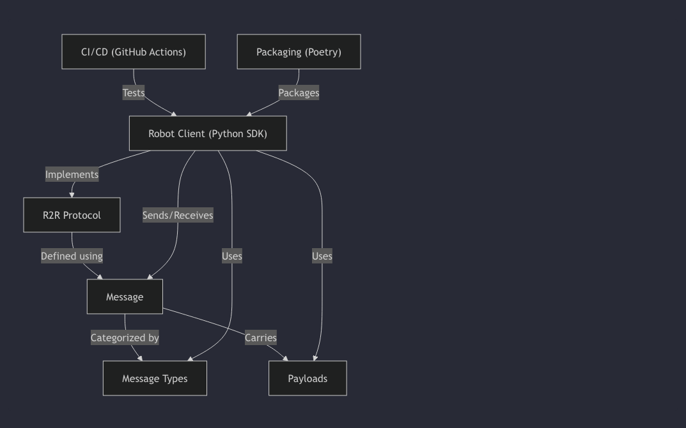

### Overview of r2r-protocol :

The r2r-protocol project defines a **standardized communication protocol** for robots to understand each other. It uses structured *Messages*, categorized by *Types*, which carry specific *Payloads* like status or commands. A *Python SDK* is provided as a *Robot Client* to implement this protocol, with automated *CI/CD* and *Packaging* processes ensuring its quality and distribution.

### **Visual Overview**

