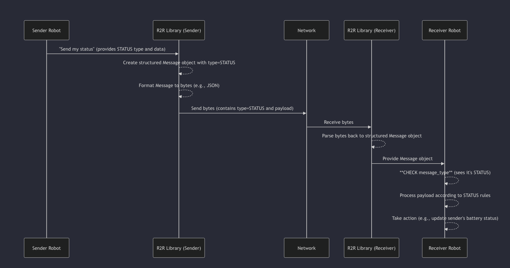

# Chapter 3 : Message Types :->

Welcome back, budding robot communicators! In Chapter 1: R2R Protocol, we introduced the idea of a universal language for robots. In Chapter 2: Message, we dove into the fundamental building block: the **Message** itself, understanding its standard structure with fields like `sender_id`, `receiver_id`, and `payload`.

We also highlighted the `message_type` field as being crucial. But *why* is it so important, and what are the different types of messages robots can send? That's what this chapter is all about!

# **Why Do Messages Need Types?**

Imagine you receive an envelope. Before opening it, you might look at the return address or a label like "Urgent Invoice," "Birthday Card," or "Catalog." This label immediately tells you the *purpose* of the communication and helps you know what kind of content to expect inside. An "Urgent Invoice" requires different handling than a "Birthday Card"!

It's the same for robots using the R2R Protocol. When a robot receives a Message, it needs to know the message's *purpose* right away. Is it:

- Reporting a problem?
- Giving a command?
- Sharing sensor data?
- Just saying "I'm still here"?

Without knowing the purpose, the robot wouldn't know how to interpret the `payload` (the actual data inside the message) or what action to take.

**Message Types** provide this crucial label. They categorize the intent and structure of the message, allowing robots to process them efficiently and correctly.

# **Introducing R2R Message Types**

The R2R Protocol defines a standard set of **Message Types**. This list is like the agreed-upon set of labels robots can put on their communication envelopes.

We saw this list briefly in Chapter 1. It's defined in the code as an `Enum` (a fixed set of named values) in `sdk/python/r2r_protocol/message_types.py`:

```python
# From: sdk/python/r2r_protocol/message_types.py

from enum import Enum

class MessageType(Enum):
    """
    Defines the different types of messages that can be exchanged.
    """

    HANDSHAKE = "handshake"       # For robots to introduce themselves
    HANDSHAKE_ACK = "handshake_ack" # To acknowledge the handshake
    COMMAND = "command"           # Sending instructions to a robot
    STATUS = "status"             # Sharing current state (e.g., idle, busy)
    TELEMETRY = "telemetry"         # Sharing sensor data (e.g., battery, position)
    ERROR = "error"               # Reporting issues
    HEARTBEAT = "heartbeat"       # Checking if a robot is still active

    NEGOTIATION = "negotiation"     # For tasks like auctioning or coordinating work
    # Add other message types as needed
```

Each value in this `MessageType` Enum represents a different category of communication. Let's look at some key ones:

| **Message Type** | **Analogy (Letter Label)** | **Purpose** | **What to Expect in Payload (Generally)** |
| --- | --- | --- | --- |
| `STATUS` | "Status Report" | Report the robot's current state (busy, idle). | Simple state information (e.g., `{"state": "idle"}`). |
| `COMMAND` | "Task Assignment" | Tell a robot to do something. | Details of the command and its parameters. |
| `TELEMETRY` | "Sensor Reading" | Share sensor data or measurements. | Numerical data (e.g., `{"battery": 0.85, "temp": 25}`). |
| `ERROR` | "Incident Report" | Report that something went wrong. | Description of the error, error code, severity. |
| `HEARTBEAT` | "I'm Still Here!" | Simple message to show the robot is alive. | Often an empty or minimal payload. |
| `NEGOTIATION` | "Contract Bid/Offer" | Coordinate tasks, bid on work, make proposals. | Details of the negotiation action (bid value, task ID). |
| `HANDSHAKE` | "Introduction" | A robot introducing itself to the network. | Robot's capabilities or identification details. |
| `HANDSHAKE_ACK` | "Introduction Received" | Acknowledging a handshake. | Confirmation details. |

By using these standardized types, every robot understands the fundamental categories of messages exchanged on the network.

# **Using Message Types: The Robot Battery Example**

Let's go back to our Delivery Robot #001 and the Charging Station robot.

The Delivery Robot needs to report its battery level so the Charging Station knows it might need charging.

1. **Delivery Robot's Intent:** "I want to tell everyone my current status, specifically my battery level."
2. **Choosing the Type:** The most appropriate type for sharing its current state is `STATUS`.
3. **Creating the Message:** The Delivery Robot creates a Message object. It sets `message_type` to `MessageType.STATUS`. The actual battery level goes into the `payload` (we'll learn more about `payloads` in the next chapter, but for now, imagine it's `{"battery_level": 15}`). Other fields (`sender_id`, `receiver_id`, `timestamp`) are also set.
4. **Sending the Message:** The Delivery Robot sends this `Message` using the R2R implementation.

Now, on the other side:

1. **Charging Station Receives Data:** The Charging Station receives the data (bytes) from the network.
2. **Parsing the Message:** The R2R implementation on the Charging Station's side parses the data back into a Message object.
3. **Checking the Type:** The Charging Station's logic *first* checks the `message_type` field of the received `Message` object. It sees `message_type` is `STATUS`.
4. **Interpreting Payload:** Because the type is `STATUS`, the Charging Station knows the `payload` contains status information. It expects keys like "battery_level" or "state" in the payload dictionary.
5. **Taking Action:** The Charging Station reads `{"battery_level": 15}` from the payload and decides that Delivery Robot #001 is low on power and might need instructions to come charge.

This is much clearer and more reliable than just sending the number `15` or a string "Battery Low", which could be easily misunderstood.

# **How Message Types are Used in Code (Conceptual)**

When a robot wants to send a specific kind of message using the Python SDK, it often calls a method named after the message type, or passes the `MessageType` enum value to a generic send function.

For example, the `RobotClient` (which we'll use in Chapter 5) has helper methods like `send_status`. Looking at the simplified `_send` method from `sdk/python/r2r_protocol/client.py` again:

```python
# Snippet from sdk/python/r2r_protocol/client.py (simplified)
import json
import time
from .message_types import MessageType # Import MessageType enum

# Assume self.robot_id is set
# Assume sock is the network connection
# Assume msg_type is a MessageType enum value (like MessageType.STATUS)
# Assume payload is the data for the message body

def _send(self, msg_type: MessageType, payload: Any):
    """
    Internal method to construct and send a message.
    Payload should be an object or dict.
    """
    message_dict = { # Create a Python dictionary representing the message structure
        "header": {
            "version": "1.0",
            "timestamp": int(time.time()),
            "source_id": self.robot_id
        },
        "type": msg_type.value, # *** HERE: Use the .value of the enum ***
        "payload": payload # Payload data goes here
    }
    
    # Convert the dictionary to a JSON string (bytes) for sending
    data_to_send = json.dumps(message_dict).encode("utf-8")
    
    # Send the data over the network
    # self.sock.sendall(data_to_send)
    # ... rest of sending logic ...
```

This snippet shows how the `MessageType` enum value (`msg_type`) is converted to its string representation (`msg_type.value`) and placed in the `"type"` field of the message dictionary before being sent.

On the receiving side, the robot's code would look something like this (conceptual simplified logic within a `listen` handler):

```python
# Snippet from robot's message handling logic (conceptual)
import json
from .message_types import MessageType # Import MessageType enum

# Assume 'received_data' is the Python dictionary parsed from the incoming JSON
received_message = received_data

# *** HERE: Read the 'type' field from the received message dictionary ***
received_type_str = received_message.get("type")
received_payload = received_message.get("payload")

if received_type_str == MessageType.STATUS.value: # Check if the type is "status"
    print("Received a Status message!")
    # Now process the payload expecting status information
    battery = received_payload.get("battery_level")
    print(f"  Battery level reported: {battery}%")
    # ... other status processing ...

elif received_type_str == MessageType.COMMAND.value: # Check if the type is "command"
    print("Received a Command message!")
    # Now process the payload expecting command details
    command_name = received_payload.get("command_name")
    print(f"  Command requested: {command_name}")
    # ... other command processing ...

elif received_type_str == MessageType.ERROR.value: # Check if the type is "error"
     print("Received an Error message!")
     # ... handle error payload ...

else:
    print(f"Received message of unknown type: {received_type_str}")
    # Handle unexpected types
```

This receiving logic clearly shows how reading the `"type"` field is the *first* step in deciding how to handle the rest of the message, especially the `payload`.

# **How it Works Under the Hood (Simplified)**

When a robot sends a message with a specific type, the R2R library puts that type information into the standard message structure before sending. When another robot receives it, the R2R library helps parse it, and the robot's application code uses the type field to figure out what to do next.





The Message Type acts as a filter and a guide for the receiving robot, making communication predictable and manageable.

# **Conclusion**

Message Types are a fundamental concept in the R2R Protocol. They provide a standardized way to categorize the purpose of any communication between robots. By labelling messages as `STATUS`, `COMMAND`, `TELEMETRY`, `ERROR`, or other defined types, robots can immediately understand the intent and know how to correctly interpret and process the message's content, the Payload.

Understanding Message Types is key to building robust robot-to-robot communication. But while the type tells us *what kind* of message it is, we still need to understand *what data* is actually inside that message's envelope.

That's where Payloads come in! Let's move on to the next chapter to explore how the actual data is structured within an R2R message.

Ready to learn about the contents of the message? Let's move on to Chapter 4: Payloads!

