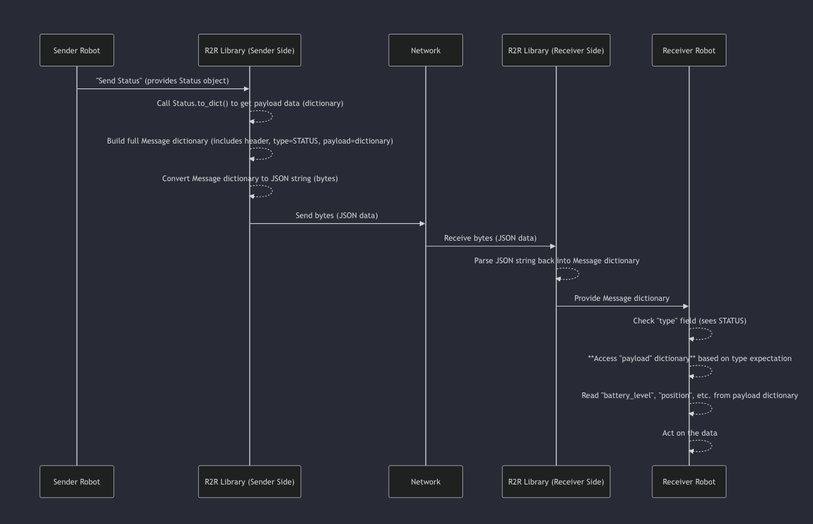

# Chapter 4 : Payloads :→

Welcome back! In the previous chapters, we've built a solid foundation for understanding the R2R Protocol. We learned about the protocol itself as a universal language (Chapter 1: R2R Protocol) and the fundamental structure of an R2R Message (Chapter 2: Message). Most recently, in Chapter 3: Message Types, we saw how the `message_type` field tells us the *purpose* of a message – whether it's a `STATUS` update, a `COMMAND`, `TELEMETRY`, etc.

But knowing the message type is only half the battle. If a robot receives a `STATUS` message, it knows it's about the sender's state, but it still doesn't know the specific details: *What* is the battery level? *Where* is the robot located? *What* task is it currently doing?

This is where the **Payload** comes in!

# **What is a Payload?**

Think of the Message as the entire envelope containing communication. The `message_type` is like the label or subject line on the envelope ("Status Update," "Urgent Command"). The **Payload** is the **actual content** written inside the envelope.

It's the specific data being carried by the message.

Just like the content you put inside an envelope depends entirely on the subject line (you write different things in a birthday card than in an invoice), the structure and content of the **Payload depend entirely on the `message_type`**.

- If the `message_type` is `STATUS`, the payload will contain information about the robot's status (battery, position, state, etc.).
- If the `message_type` is `COMMAND`, the payload will contain the details of the command (what action to perform, what parameters to use).
- If the `message_type` is `TELEMETRY`, the payload will contain sensor data or measurements.
- If the `message_type` is `ERROR`, the payload will contain details about the error that occurred.

The Payload is the part of the message where the specific, variable data for that particular communication is stored.

# **Payloads in the Robot Battery Example**

Let's return to our Delivery Robot #001 needing to tell the Charging Station its battery is low.

1. The Delivery Robot decides it needs to send a **Message**.
2. It determines the `message_type` should be `STATUS` because it's reporting its current state.
3. Now, it needs to figure out **what data to put in the Payload** for this `STATUS` message. It needs to include:
    - Its current status state (e.g., "moving", "idle", "charging").
    - Specific details, like the battery level (15%).
    - Maybe its current location.

So, the Delivery Robot prepares a payload that looks something like this:

```python
{
    "status": "moving",
    "details": {
        "battery_level": 15,
        "position": {"x": 10.2, "y": 5.1}
    }
}
```

This specific data structure is the **Payload**. It's designed to fit the requirements of a `STATUS` message according to the R2R Protocol.

When the Charging Station receives the full Message:

1. It parses the message and sees the `message_type` is `STATUS`.
2. Because it knows the type is `STATUS`, its internal logic knows to look for a payload with fields like "status" and "details", and inside "details", fields like "battery_level" and "position".
3. It extracts `15` from `"details"]["battery_level"]` and realizes the Delivery Robot is low on battery.

The `message_type` tells the robot *how* to interpret the `payload`, and the `payload` provides the specific data needed for that interpretation.

# **Defining Payload Structures in Code**

The R2R Protocol Python SDK provides helper classes to define the structure of payloads for common Message Types. You can find these in the `sdk/python/r2r_protocol/payloads.py` file.

Let's look at the `Status` payload class:

```python
# Snippet from sdk/python/r2r_protocol/payloads.py

from typing import Dict, Any

class Status:
    """
    Represents the payload for a STATUS message.
    """
    def __init__(self, status: str, details: Dict[str, Any] = None):
        self.status = status
        self.details = details if details is not None else {}

    def to_dict(self) -> Dict[str, Any]:
        return {
            "status": self.status,
            "details": self.details
        }
```

This `Status` class is a blueprint for the data that should go into a `STATUS` message's payload. It has:

- A required `status` field (a string like "idle", "busy").
- An optional `details` dictionary for extra specific data (like battery level, position).
- A `to_dict()` method which converts the object into a Python dictionary that matches the expected structure for JSON serialization.

Similarly, the `CommandPayload` class defines what goes into a `COMMAND` message's payload:

```python
# Snippet from sdk/python/r2r_protocol/payloads.py

from typing import Any, Dict, List
from dataclasses import dataclass, field # dataclass helps simplify this

@dataclass
class CommandPayload:
    command_name: str # e.g., "go_to", "charge", "pickup_item"
    args: List[Any] = field(default_factory=list) # Positional arguments
    kwargs: Dict[str, Any] = field(default_factory=dict) # Keyword arguments

    def to_dict(self) -> Dict[str, Any]:
        return {
            "command_name": self.command_name,
            "args": self.args,
            "kwargs": self.kwargs,
        }
```

This `CommandPayload` expects a `command_name` and optional `args` (like a list of coordinates) and `kwargs` (like a dictionary of named parameters like `{"speed": 0.5}`). Again, it has a `to_dict()` method.

These classes ensure that when you create a payload object for a specific type, it has the necessary fields and structure.

# **Creating Payloads in Code (Using the SDK)**

When our Delivery Robot wants to send its status using the Python SDK, it would create an instance of the `Status` payload class and then use a method like `client.send_status`.

Here's how that might look:

```python
# Conceptual code using the SDK (simplified)
from r2r_protocol.client import RobotClient
from r2r_protocol.payloads import Status # Import the Status payload class

# Assume 'client' is a configured RobotClient instance
# client = RobotClient(...)

# 1. Create the specific payload data using the Status class
status_data = Status(
    status="moving", # Set the main status string
    details={ # Add specific details in the details dictionary
        "battery_level": 15,
        "position": {"x": 10.2, "y": 5.1}
    }
)

# 2. Use the client to send the message with the correct type and the payload object
# The send_status method internally knows the message type is STATUS
# and uses the to_dict() method of the status_data object
# client.send_status(status_data)

print(f"Prepared payload for Status message: {status_data.to_dict()}")
# Expected output (or similar dictionary representation):
# Prepared payload for Status message: {'status': 'moving', 'details': {'battery_level': 15, 'position': {'x': 10.2, 'y': 5.1}}}

```

Notice that we create a `Status` object containing the required data (`status="moving"`) and the optional details (`details={...}`). When `client.send_status(status_data)` is called (conceptually), the SDK takes this `status_data` object, uses its `to_dict()` method to get the dictionary representation, and places that dictionary into the `payload` field of the full R2R Message structure before sending.

If the robot wanted to send a command, it would use the `CommandPayload` class:

```python
# Conceptual code using the SDK (simplified)
from r2r_protocol.client import RobotClient
from r2r_protocol.payloads import CommandPayload # Import the CommandPayload class

# Assume 'client' is a configured RobotClient instance
# client = RobotClient(...)

# 1. Create the specific payload data using the CommandPayload class
command_data = CommandPayload(
    command_name="go_to", # The name of the command
    args=[50.0, 25.0]    # Positional arguments (like x, y coordinates)
    # kwargs={"speed": 0.8} # Optional keyword arguments
)

# 2. Use the client to send the command message
# This might be client.send_command(command_data) or client._send(MessageType.COMMAND, command_data)
# print(f"Prepared payload for Command message: {command_data.to_dict()}")
# Expected output: Prepared payload for Command message: {'command_name': 'go_to', 'args': [50.0, 25.0], 'kwargs': {}}
```


The key idea is that you create a Python object representing the specific data structure for that `message_type`'s payload, and the SDK handles packaging it correctly into the full Message structure.

# **Processing Payloads on the Receiving Side**

When a robot receives a message, after identifying the `message_type`, it needs to extract the relevant data from the `payload`. The robot's application code knows *what to expect* in the payload based on the type.

```python
# Conceptual receiving logic within a robot's handler
from r2r_protocol.message_types import MessageType

# Assume 'received_message_dict' is the dictionary parsed from the incoming JSON data
# It looks something like:
# {
#    "header": {...},
#    "type": "status",
#    "payload": {"status": "moving", "details": {"battery_level": 15, "position": {"x": 10.2, "y": 5.1}}}
# }

received_type_str = received_message_dict.get("type")
received_payload_dict = received_message_dict.get("payload") # Get the payload dictionary

if received_type_str == MessageType.STATUS.value: # Check if it's a Status message
    print("Received a Status message!")
    # Now, access the data within the payload dictionary, knowing its structure
    current_status = received_payload_dict.get("status")
    details = received_payload_dict.get("details", {}) # Use .get with default to be safe
    battery = details.get("battery_level")
    position = details.get("position")

    print(f"  Status: {current_status}")
    print(f"  Battery Level: {battery}%")
    print(f"  Position: {position}")

elif received_type_str == MessageType.COMMAND.value: # Check if it's a Command message
    print("Received a Command message!")
    # Access command details from the command payload structure
    command_name = received_payload_dict.get("command_name")
    args = received_payload_dict.get("args", [])
    kwargs = received_payload_dict.get("kwargs", {})

    print(f"  Command Name: {command_name}")
    print(f"  Arguments: {args}")
    print(f"  Keyword Arguments: {kwargs}")
    # Robot would then execute this command...

# ... handle other message types similarly ...

else:
    print(f"Received message of unknown type: {received_type_str}")
```

This snippet shows how the receiving code first checks the message type (`received_type_str`) and then, based on that type, accesses specific keys and structures within the `received_payload_dict` to get the actual data.


# **How Payloads Work Under the Hood (Simplified)**

Let's trace the journey of a payload from sending robot to receiving robot.




The `RobotClient`'s internal `_send` method, which we touched upon earlier, demonstrates how the payload object is converted and placed into the message structure:

```python
# Snippet from sdk/python/r2r_protocol/client.py (simplified)
import json
import time
from typing import Any
from .message_types import MessageType

# Assume self.robot_id is set, sock is network connection
# msg_type is a MessageType enum value (e.g., MessageType.STATUS)
# payload is the payload object (e.g., Status instance)

def _send(self, msg_type: MessageType, payload: Any):
    """
    Internal method to construct and send a message.
    Payload should be an object with a to_dict() method or a dictionary.
    """
    message_dict = {
        "header": {
            "version": self.message_version,
            "timestamp": int(time.time()),
            "source_id": self.robot_id
        },
        "type": msg_type.value,
        # *** HERE: Call to_dict() on the payload object if it has the method ***
        "payload": payload.to_dict() if hasattr(payload, 'to_dict') else payload
    }

    # Convert the Python dictionary 'message_dict' to JSON bytes
    data_to_send = json.dumps(message_dict).encode("utf-8")

    # Send the data over the network
    # self.sock.sendall(data_to_send)
    # ... rest of sending logic ...
```

This simplified code shows how the `payload` argument (which is an instance of `Status`, `CommandPayload`, etc.) is processed: `payload.to_dict()` is called to get the dictionary representation, and *that dictionary* is assigned to the `"payload"` key in the `message_dict`. This `message_dict` is then converted to JSON bytes and sent.

On the receiving side, the R2R library (like the Python SDK's listening logic) parses the incoming bytes back into this `message_dict`, and the robot's application code then directly accesses the nested `payload` dictionary using standard dictionary access (`received_message_dict.get("payload")`).

# **Conclusion**

The **Payload** is the heart of the R2R Message – it carries the actual data specific to that communication. Its structure is not arbitrary; it is precisely defined by the Message Type. By using standardized payload structures (like the classes in `payloads.py`), robots ensure that the data they send and receive is formatted predictably, allowing other robots to correctly understand and act upon the information.

We've now covered the fundamental building blocks of the R2R Protocol: the overall protocol idea, the standard Message structure, the concept of Message Types to categorize intent, and finally, the **Payload** as the structured container for the actual data.

In the next chapter, we'll finally get hands-on with the Python SDK to see how we can use these concepts to actually send and receive R2R messages from a robot client!

Ready to start building robot communication code? Let's move on to Chapter 5: Robot Client (Python SDK)!


