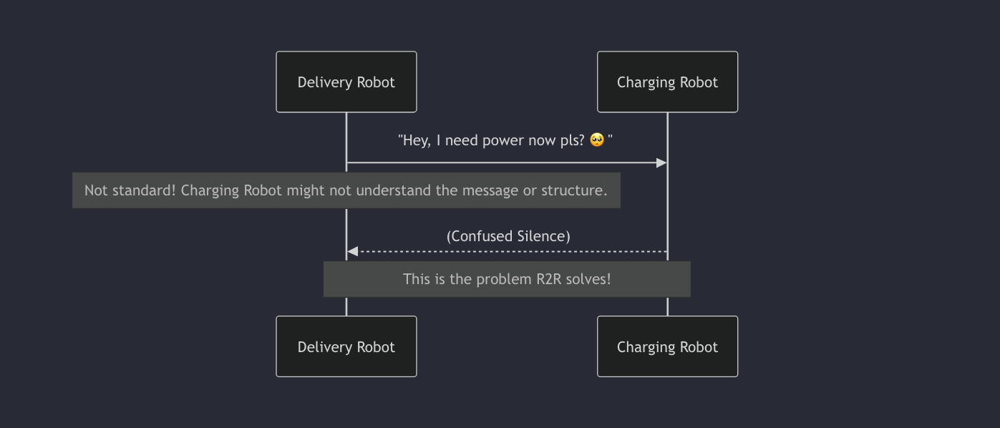
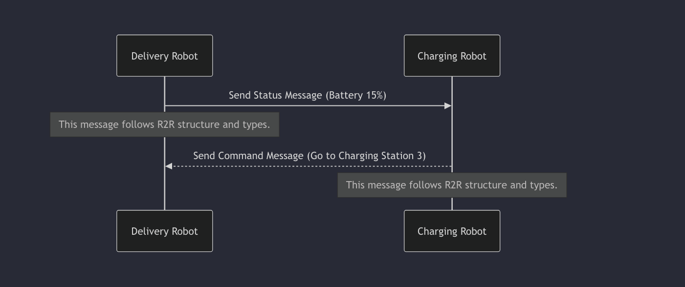

# Chapter 1 : R2R Protocol :->

Imagine a world where robots are everywhere – in factories, warehouses, even helping around our homes. Now, imagine these robots need to work *together*. A delivery robot might need to tell a charging station robot it's low on battery. A cleaning robot might need to tell a security robot it's finished with a sector.

But robots are made by different companies, just like we use phones from different brands. How can these different robots understand each other? If one robot sends a message saying "Battery low," how does another robot know what "Battery low" means, or even how the message is structured?

This is where the **R2R Protocol** comes in.

Think of the R2R Protocol as a **universal language and a set of rules specifically designed for robots to talk to each other**. It's like English for robots, but with a clear grammar and vocabulary that every robot using the protocol agrees upon.

The goal? To make sure that different robots, regardless of who made them or what they look like, can communicate seamlessly.

# **Why Do Robots Need a Protocol?**

Without a standard protocol, robot communication would be chaos. Each manufacturer would invent their own way for robots to talk, and robots from one system wouldn't be able to understand robots from another. It would be like trying to have a conversation with someone who only speaks Mandarin when you only speak Spanish – impossible without a translator!

The R2R Protocol acts as that translator, providing:

1. **A Common Language:** Defines the vocabulary and structure for robot messages.
2. **Clear Rules:** Specifies how messages should be sent, received, and interpreted.
3. **Interoperability:** Allows robots from different vendors or systems to work together effectively.

Let's revisit our warehouse example. We have a Delivery Robot that moves items and a Charging Robot that manages charging stations.



If both robots understand the R2R Protocol, their conversation looks very different:



See the difference? With R2R, messages have a defined structure and meaning that both robots recognize.

# **What Does the R2R Protocol Define?**

At its core, the R2R Protocol defines the building blocks of robot communication. The most fundamental building block is the **Message**.

Every piece of communication between robots using R2R is packaged into a **Message**.

A Message isn't just a random string of data. According to the R2R Protocol, it has a specific structure, containing information like:

- Who sent it?
- Who is it for?
- What kind of message is it (e.g., is it telling you its status, giving a command, reporting an error)?
- What's the actual data being sent (e.g., battery level, command details)?

Let's take a peek at the basic structure of an R2R Message as defined in the Python SDK's code (specifically in `sdk/python/r2r_protocol/message_format.py`):

```python
# From: sdk/python/r2r_protocol/message_format.py

class Message:
    def __init__(self, message_id, message_type, sender_id, receiver_id, timestamp, payload):
        self.message_id = message_id       # A unique number for this specific message
        self.message_type = message_type   # What kind of message is this? (e.g., "status", "command")
        self.sender_id = sender_id         # Who sent the message? (e.g., "delivery_robot_001")
        self.receiver_id = receiver_id     # Who is the message for? (e.g., "charging_station_003" or "all")
        self.timestamp = timestamp         # When was the message sent?
        self.payload = payload             # The actual data/content of the message
```

This Message class shows us the required pieces of information for any communication using R2R. Just like a standard letter needs a recipient, sender, and content, an R2R Message needs these components.

The R2R Protocol standardizes these components:

- **`sender_id`** and **`receiver_id`**: Every robot or entity involved in communication gets a unique ID.
- **`message_type`**: R2R defines standard categories for messages. We'll explore these more in Chapter 3: Message Types, but they include things like `STATUS`, `COMMAND`, `TELEMETRY`, and `ERROR`.
- **`payload`**: This is where the specific data for the message goes. What goes in the payload depends on the `message_type`. For example, a `STATUS` message might have a payload containing battery level and location, while a `COMMAND` message might have a payload specifying the command name ("go_to_location") and its parameters (the destination coordinates). We'll dive into payloads in Chapter 4: Payloads.

The R2R Protocol ensures that when a robot receives a message, it knows exactly what kind of information to expect and how to interpret it because it understands this standard structure and these standard types.

Look at the `MessageType` definition from the code (`sdk/python/r2r_protocol/message_types.py`):

```python
# From: sdk/python/r2r_protocol/message_types.py

from enum import Enum

class MessageType(Enum):
    """
    Defines the different types of messages that can be exchanged.
    """

    HANDSHAKE = "handshake"       # For robots to introduce themselves
    HANDSHAKE_ACK = "handshake_ack" # To acknowledge the handshake
    COMMAND = "command"           # Sending instructions to a robot
    STATUS = "status"             # Sharing current state (e.g., idle, busy)
    TELEMETRY = "telemetry"         # Sharing sensor data (e.g., battery, position)
    ERROR = "error"               # Reporting issues
    HEARTBEAT = "heartbeat"       # Checking if a robot is still active

    NEGOTIATION = "negotiation"     # For tasks like auctioning or coordinating work
    # Add other message types as needed
``` 

This predefined list of `MessageType` values is part of the R2R standard. A robot receiving a message with `message_type` set to `"status"` knows it should expect a payload containing information about the sender's current state, not a command to perform an action.

# **How it Works Under the Hood (Simplified)**

When a robot wants to send information using R2R:

1. It gathers the necessary data (e.g., its battery level, its ID).
2. It creates an R2R `Message` object using the standard structure (sets `message_type`, `sender_id`, `payload`, etc.).
3. It uses the R2R implementation (like the Python SDK) to format this `Message` object into a series of bytes that can be sent over a network (like turning a Python object into a JSON string).
4. It sends these bytes to the target robot(s) using a chosen communication method (like Wi-Fi).

When a robot receives these bytes:

1. It uses the R2R implementation to parse the bytes back into an R2R `Message` object.
2. It validates the message to ensure it follows the protocol rules (e.g., are all required fields present?).
3. It looks at the `message_type` and `payload` to understand what the message is about and extract the relevant data.
4. It then takes action based on the message content (e.g., if it's a `COMMAND` message, it executes the command; if it's a `STATUS` message, it updates its internal record of that robot's status).

The R2R Protocol standardizes steps 2 and 3 in the sending process and steps 1, 2, and 3 in the receiving process. It provides the common ground.

# **Conclusion**

In this chapter, we learned that the **R2R Protocol** is essentially a universal language and rulebook for robots. Its main purpose is to enable seamless communication and collaboration between different types of robots, regardless of their origin. We saw that the core of this protocol is the standardized **Message** structure, which includes essential information like sender, receiver, message type, and the actual data (payload). This structure ensures that robots can understand the meaning and intent behind the messages they exchange.

Ready to dive deeper into the fundamental unit of R2R communication?

Let's move on to Chapter 2: Message!

